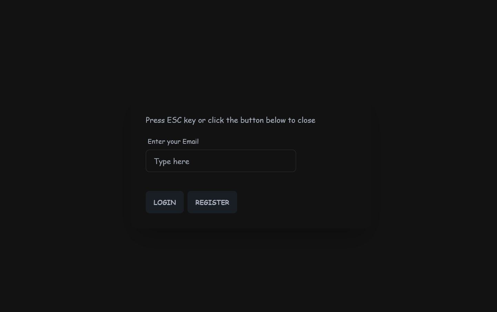
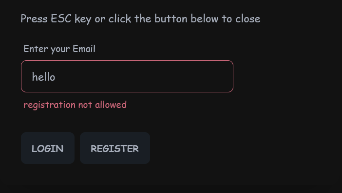
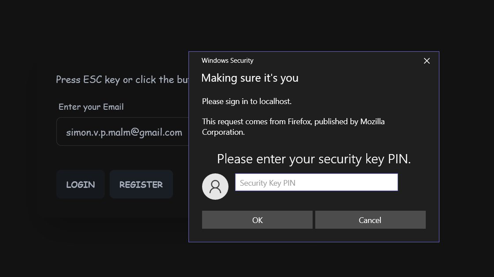
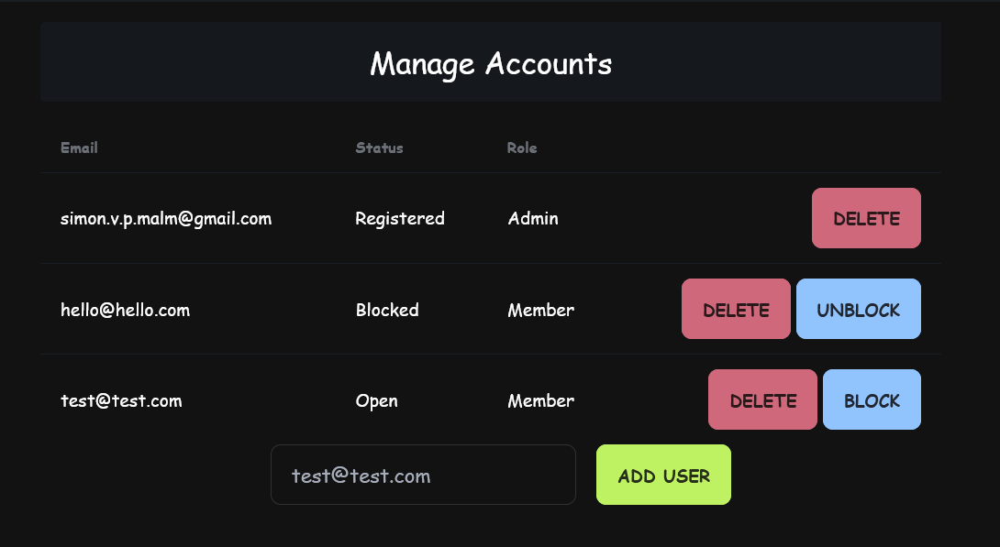

# Introduction
This project is intended to be for personal learning, familiarizing myself with golang, htmx and the 
webauthn protocal to achieve passwordless login. 

You can download the project image and test for yourself:
[docker hub repo](https://hub.docker.com/repository/docker/a19simma/go-webauthn-htmx/general)
`docker run --rm -e AUTH_ADMIN_EMAIL=hello -e AUTH_ORIGIN=http://localhost:4200 -p 4200:4200 a19simma/go-webauthn-htmx:0.2`

# Following are some screenshots of the UI

